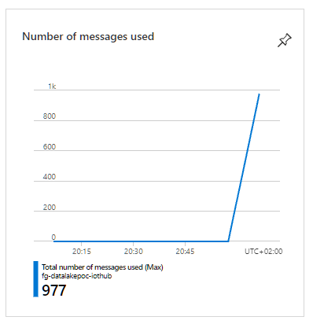
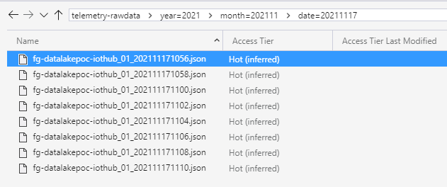
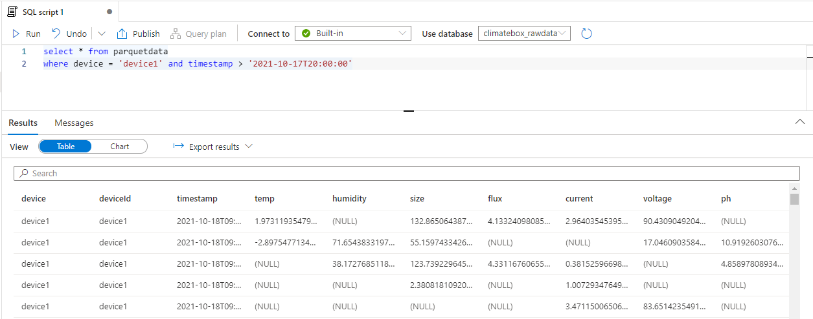
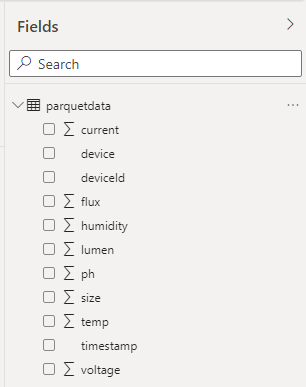
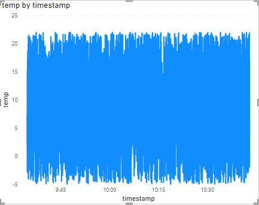
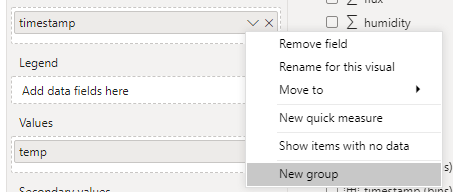
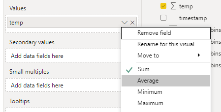
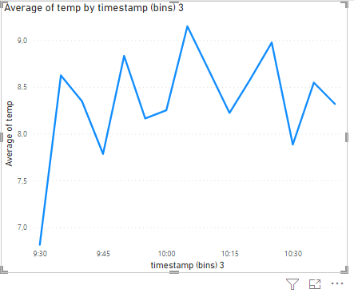

## Introduction

This project is a PoC to see how we can ingest received telemetry data directly into a Data Lake from IoT Hub, and query that data using Azure Synapse.

> Disclaimer: This is a PoC and is setup as such.  This means that shortcuts have been taken and this code should not be used in a production scenario.  In a real-world/production scenario, sensitive information (such as connection-strings, passwords, ...) must be stored in KeyVault instead of putting them directly into the configuration, deployment should be done via CI/CD pipelines, etc...

## Getting started

### Deploy resources

First of all, some Azure resources must be created.  This project contains a bicep file which describes all the resources that are required.  This file can be found in the `deploy\azure` folder.

If you inspect the `infrastructure.bicep` file, you'll notice that some parameters are declared which you can override to define the resource-names.  
Most of the parameters have default values. However, there is one parameter which is required to be specified at deployment time: `synapse_admin_password`

Create the required Azure resources by executing the following statement:

```azcli
az deployment group create --subscription <subscriptionid> --resource-group <resourcegroupname> --template-file infrastructure.bicep --parameters synapse_admin_password=<your strong password>
```
(It takes a while before this command finishes and all resources are provisioned)

The password that you have specified, will be stored in the KeyVault resource that is deployed.

This deployment will also make sure that the Function App that is deployed and the deployer of the template, have the `Blob Contributor` role assigned to the Data Lake, as this is a requirement to be able to interact with the information that is stored in the Data Lake.

> Note that the user which has deployed this bicep file will be added to the `Synapse Administrator` role in Synapse.  If you deploy this bicep template via a deployment pipeline, the Service Principal that is behind the service connection will be a `Synapse Administrator`.
> If you have `roleAssignment/write` permissions, you can add other users or groups to the `Synapse Administrator` role as well.  This can be done via The Azure Synapse workspace Studio (under Management / Access control) or via [`az synapse role assignment`](https://docs.microsoft.com/en-us/cli/azure/synapse/role/assignment?view=azure-cli-latest) or via [`New-AzSynapseRoleAssignment`](https://docs.microsoft.com/en-us/powershell/module/az.synapse/new-azsynapseroleassignment?view=azps-7.1.0).
> Be aware that in this case, you can only add other users or groups to the `Synapse Administrator` role.  Members of the `Synapse Administrator` role can add users or group to other Synapse roles.

### Prepare the Synapse workspace

Go to the Azure Portal and find the Azure Synapse resource that has been deployed in the previous step.  Open the Synapse Workspace via the *Workspace web URL* that can be found in the Overview blade.

Execute the scripts that are found in the `create-rawdatabase.sql` and `create-user.sql` files via the Synapse Workspace.  Do this via the 'Develop' tab and make sure that you're connected to the 'Built-in' pool.

> Make sure that the address of the DataLake is set correctly in those scripts.
> Make sure that the name of the Function app is correctly set in the `create-user.sql` script.

## Running the solution

Once all infrastructure has been deployed, we can run the PoC.  There's just one thing that must be taken care of: a device must be registered in IoT Hub which will represent our 'telemetry simulator'.
To do that, run the following Azure CLI command:

```pwsh
PS > az iot hub device-identity create -n {iothub-name} -d telemetrysimulator
```

### Run the device simulator

Open the DeviceSimulator solution, and find the `appsettings.json` file.  In this file, the connectionstring of the device that has been created in IoT Hub must be set.   You can find that connectionstring either via the Azure Portal, or by executing this Azure CLI command:

```pwsh
PS > az iot hub device-identity connection-string show -n {iothub-name} -d telemetrysimulator
```

Once the connectionstring has been set in the appsettings.json file, hit F5 and the simulator should start sending messages to IoT Hub.

Verify if data is being received in IoT Hub:



After a while, you should also that files are being created in the `telemetry-rawdata` container that exists in the Data Lake storage account:



### Publish the RawDataProcessor solution to Azure

Open the RawDataProcessor solution and publish the solution to the (Linux) Function App that has been deployed in Azure.  This can easily be done from Visual Studio.NET but make sure that you select `linux-x64` as Target Runtime.

Once deployed, the Function will start processing the raw telemetry that is dumped by IoT Hub in the datalake, and will convert it to parquet files that are also stored in the datalake.

After some time, you'll see `*.parquet` files start appearing in the `parquet-contents` container:


The parquet files that have been created, contain a table that group the telemetry values per timestamp.  Each row in the table represents a timestamp, each column represents a metric that is valid on that timestamp.

If you want to run the Azure Function locally, be sure to create a `local.settings.json` file with these contents:

```json
{
  "IsEncrypted": false,
  "Values": {
    "AzureWebJobsStorage": "UseDevelopmentStorage=true",
    "FUNCTIONS_WORKER_RUNTIME": "dotnet",
    "SettingsStorage": "<connectionstring to the rawdataprocessorfunctionapp_storageaccount storage account>",
    "RawTelemetryConnectionString": "<connectionstring to the Synapse Database in the Serverless Pool f.i = Data Source=tcp:xxxxx-synapse-ondemand.sql.azuresynapse.net,1433; Initial Catalog=db1;>",
    "ParquetStorage": "<connectionstring to the DataLake storage account>"
  }
}
```

### Query Parquet files

In an earlier step, the `parquetdata` view was created.  Use this view to verify if the `RawDataProcessor` is creating queryable parquet files.



## Reporting via PowerBI

- Open the PowerBI desktop application and create a new `DirectQuery` dataset for a SQL Server datasource.
In the `Server` textbox, copy the address of the Synapse Serverless SQL Endpoint.
In the `Database` textbox, put the name of the database that has been created via the `create-rawdatabase.sql` script.
Use your Microsoft account to connect to the database that is hosted in Synapse.

- On the next screen, specify that data must be loaded from the `parquetdata` view.

- If everything goes well, you should now see the columns that are defined in the `parquetdata` view:

  

- Add a LineChart to your report and drag the `timestamp` field to the `Axis` section
  
- Drag a metric value (for example `temp`) to the `Values` section

- Specify a filter which limits the period for which we display values
  
- You'll see a graph which plots every value that exists for the selected timeframe:

  

- Aggregate the data by applying grouping on the `timestamp` field and display the average temperature by group:

  

  

  

  The chart should update to something that looks like this:

  
