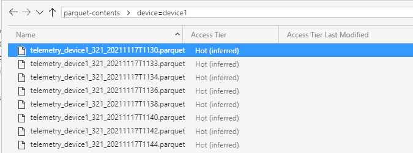

## Introduction

This project is a PoC to see how we can ingest received telemetry data directly into a Data Lake from IoT Hub, and query that data using Azure Synapse.

Note that this is a PoC and is setup as such.  This means that shortcuts have been taken.  In a real-world/production scenario, sensitive information (such as connection-strings, passwords, ...) must be stored in KeyVault instead of putting them directly into the configuration.

## Getting started

### Deploy resources

First of all, some Azure resources must be created.  This project contains a bicep file which describes all the resources that are required.  This file can be found in the `deploy\azure` folder.

If you inspect the `infrastructure.bicep` file, you'll notice that some parameters are declared which you can override to define the resource-names.  
Most of the parameters have default values. However, there is one parameter which is required to be specified at deployment time: `synapse_admin_password`

Create the required Azure resources by executing the following statement:

```azcli
az deployment group create --subscription <subscriptionid> --resource-group <resourcegroupname> --template-file infrastructure.bicep --parameters synapse_admin_password=<your strong password>
```

The password that you have specified, will be stored in the KeyVault resource that is deployed.

This deployment will also make sure that the Function App that is deployed and the deployer of the template, have the `Blob Contributor` role assigned to the Data Lake, as this is a requirement to be able to interact with the information that is stored in the Data Lake.

### Prepare the Synapse workspace

Go to the Azure Portal and find the Azure Synapse resource that has been deployed in the previous step.

Execute the scripts that are found in the `create-rawdatabase.sql` and `create-user.sql` files via the Synapse Workspace.

## Running the solution

Once all infrastructure has been deployed, we can run the PoC.  There's just one thing that must be taken care of: a device must be registered in IoT Hub which will represent our 'telemetry simulator'.
To do that, run the following Azure CLI command:

```pwsh
PS > az iot hub device-identity create -n {iothub-name} -d telemetrysimulator
```

### Run the device simulator

Open the DeviceSimulator solution, and find the `appsettings.json` file.  In this file, the connectionstring of the device that has been created in IoT Hub must be set.   You can find that connectionstring either via the Azure Portal, or by executing this Azure CLI command:

```pwsh
PS > az iot hub device-identity connection-string show -n {iothub-name} -d telemetrysimulator
```

Once the connectionstring has been set in the appsettings.json file, hit F5 and the simulator should start sending messages to IoT Hub.

Verify if data is being received in IoT Hub:


After a while, you should also that files are being created in the `climateboxes-rawdata` folder:


### Publish the RawDataProcessor solution to Azure

Open the RawDataProcessor solution and publish the solution to the Function App that has been deployed in Azure.

Once deployed, the Function will start processing the raw telemetry that is dumped by IoT Hub in the datalake, and will convert it to parquet files that are also stored in the datalake.

After some time, you'll see *.parquet files start appearing in the `parquet-contents` container:



The parquet files that have been created, contain a table that group the telemetry values per timestamp.  Each row in the table represents a timestamp, 

### Query Parquet files

In an earlier step, the `parquetdata` view was created.

